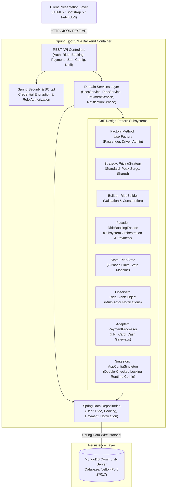
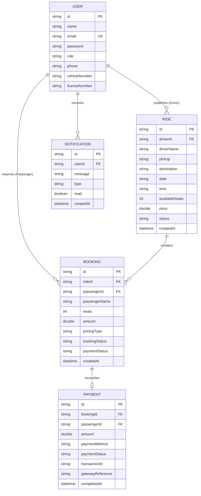

# VELTO — System Architecture & Technical Specification

## 1. Executive Summary
**VELTO** is an enterprise-grade, full-stack ride sharing platform engineered for campus and metropolitan commuter ecosystems. Built with **Java 17**, **Spring Boot 3.3.4**, and **MongoDB**, VELTO models real-world transportation logistics with atomic booking transactions, dynamic demand-driven pricing, unified payment gateway adapters, and lifecycle state machines.

A central objective of the platform is demonstrating **8 Gang of Four (GoF) Design Patterns**, each purposefully addressing a specific architectural bottleneck in real-world distributed ride sharing.

---

## 2. High-Level Architectural Blueprint

---

## 3. Layered Architectural Model

VELTO strictly adheres to the **Hexagonal / Layered Architecture** paradigm:

1. **Presentation Layer (`frontend/`)**:
   - Zero-bloat client: HTML5, CSS3 Variables, Bootstrap 5.3, Bootstrap Icons.
   - Modular Fetch API client (`api.js`) communicating asynchronously via standard REST/JSON over HTTP.
   - Client-side session and role management (`auth.js`) stored in `localStorage`.
   - Dynamic view switcher supporting Passenger, Driver, Admin, and 8 Design Patterns Showcase portals.

2. **API & Controller Layer (`com.velto.controller`)**:
   - Exposes RESTful endpoints conforming to HTTP standards (GET, POST, PUT, PATCH, DELETE).
   - Enforces cross-origin resource sharing (`CorsConfig.java`) allowing safe frontend integration.
   - Validates all incoming payloads using Bean Validation (`jakarta.validation.*`).
   - Centralizes error response handling via `@RestControllerAdvice` (`GlobalExceptionHandler.java`).

3. **Pattern & Subsystem Layer (`com.velto.pattern.*`)**:
   - Encapsulates discrete software engineering algorithms into isolated, testable design patterns:
     - `com.velto.pattern.factory`: Dynamic instantiation of polymorphic user classes.
     - `com.velto.pattern.strategy`: Demand and occupancy-based dynamic fare calculations.
     - `com.velto.pattern.builder`: Step-by-step verified construction of immutable ride documents.
     - `com.velto.pattern.facade`: High-level coordination of the 6-step ride booking transaction.
     - `com.velto.pattern.state`: Strict state transitions and invariant protection for ride lifecycles.
     - `com.velto.pattern.observer`: Real-time decoupled notifications to passengers, drivers, and admins.
     - `com.velto.pattern.adapter`: Unification of disparate external payment gateways (UPI, Card, Cash).
     - `com.velto.pattern.singleton`: Thread-safe, double-checked locking global configuration manager.

4. **Service & Business Logic Layer (`com.velto.service`)**:
   - Implements core business logic, orchestrates cross-repository updates, and hashes credentials using BCrypt.

5. **Persistence & Data Access Layer (`com.velto.repository`)**:
   - Leverages Spring Data MongoDB `MongoRepository<T, ID>` with custom query derivations and compound indexing.

6. **Database Layer (`database/`)**:
   - MongoDB Community Server with polymorphic document mapping (`_class` discriminator for Users).

---

## 4. Entity Relationship Diagram (ERD)

---

## 5. Security & Authentication Architecture
- **Password Hashing**: BCrypt strong hashing algorithm with 10 salt rounds (`BCryptPasswordEncoder`).
- **Authorization**: Role-based access control checking `Role.PASSENGER`, `Role.DRIVER`, `Role.ADMIN`.
- **Validation**: Jakarta Bean Validation (`@NotBlank`, `@Email`, `@Min`, `@NotNull`, `@Size`) guarding against malformed payloads.
- **SQL/NoSQL Injection Defense**: Spring Data MongoDB parameterized query builders defend against operator injection.
- **Global Error Masking**: `GlobalExceptionHandler` ensures stack traces are never leaked to external clients.
