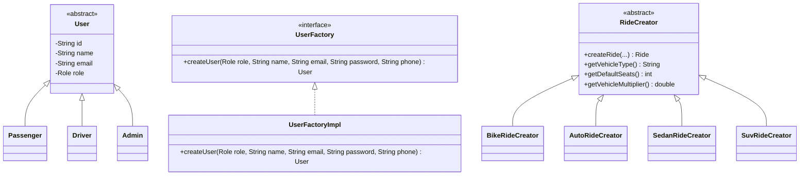
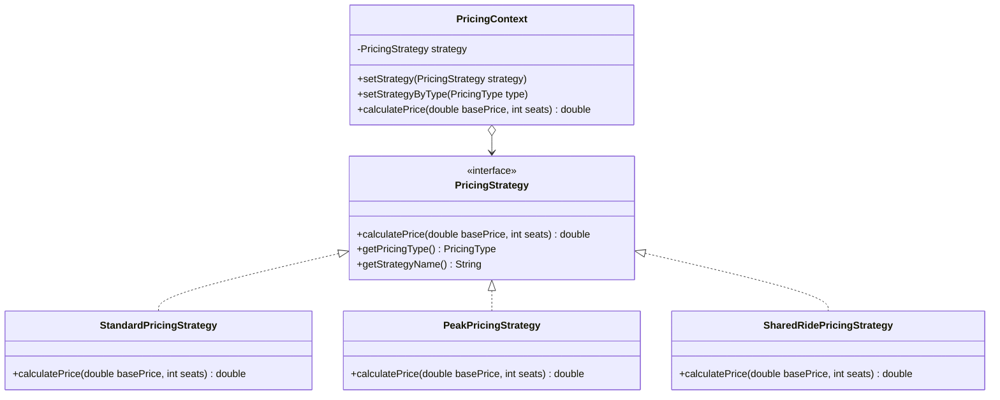
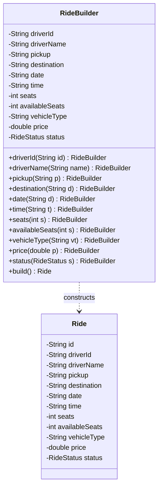
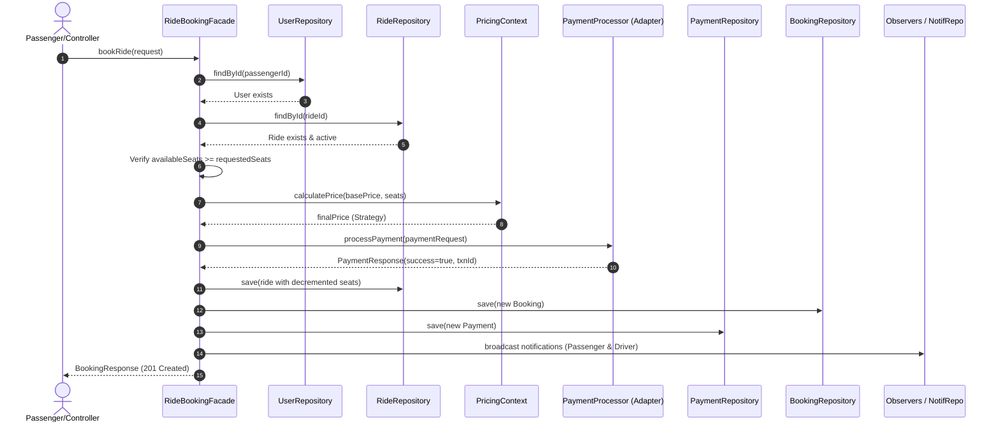
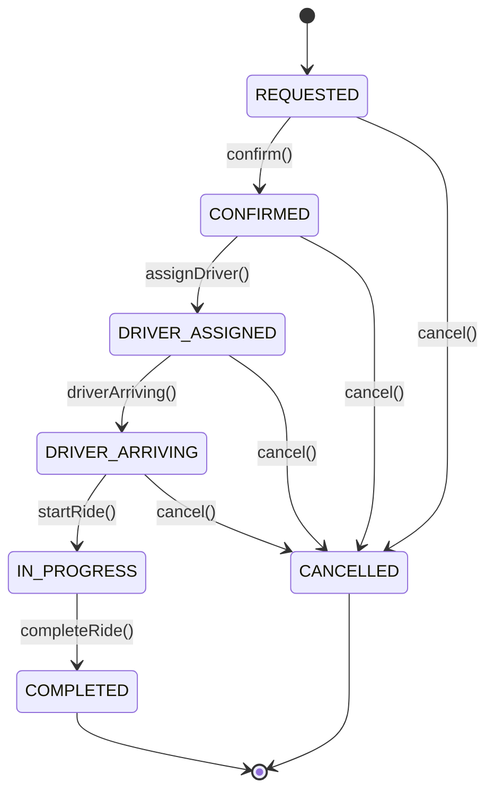
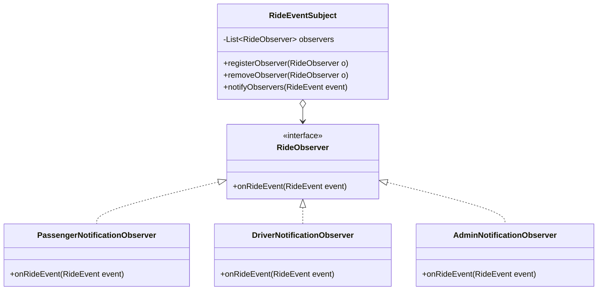
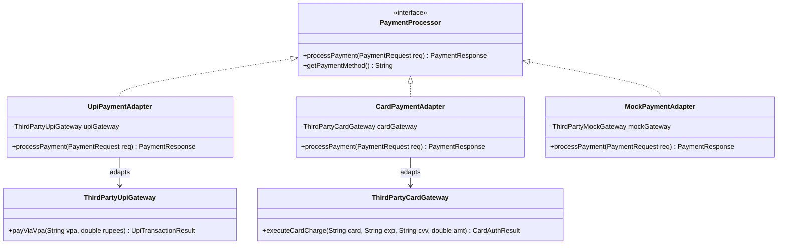
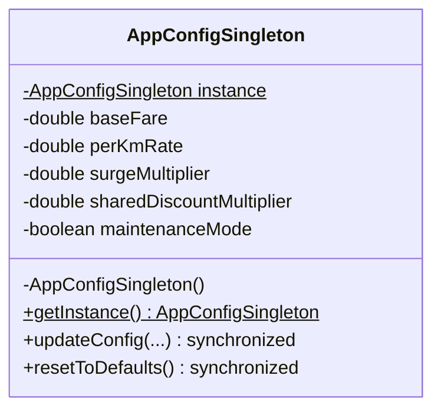

# VELTO — Complete 8 GoF Design Patterns Catalog

Every pattern in VELTO solves a concrete software engineering challenge in real-world ride sharing. Below is the technical specification, UML diagrams, implementation classes, and viva defense rationale for all 8 patterns.

---

## Summary Matrix

| # | Pattern | GoF Classification | Package Location | Real-World Domain Problem Solved |
|---|---|---|---|---|
| **1** | **Factory Method** | Creational | `com.velto.pattern.factory` | Polymorphic user creation with role-specific invariants (Passengers, Drivers, Admins). |
| **2** | **Strategy** | Behavioral | `com.velto.pattern.strategy` | Dynamic pricing calculation (Standard 1.0x, Peak Surge 1.5x, Shared Carpool 0.8x). |
| **3** | **Builder** | Creational | `com.velto.pattern.builder` | Safe construction of complex, multi-field `Ride` documents avoiding telescoping constructors. |
| **4** | **Facade** | Structural | `com.velto.pattern.facade` | Simplifying the complex 6-step ride booking subsystem behind one atomic method call. |
| **5** | **State** | Behavioral | `com.velto.pattern.state` | Managing ride lifecycle transitions and blocking illegal state transitions without nested switches. |
| **6** | **Observer** | Behavioral | `com.velto.pattern.observer` | Decoupled notification broadcasting to passengers, drivers, and admins on ride events. |
| **7** | **Adapter** | Structural | `com.velto.pattern.adapter` | Harmonizing incompatible third-party payment APIs (UPI VPA, Credit/Debit Card, Cash). |
| **8** | **Singleton** | Creational | `com.velto.pattern.singleton` | Thread-safe, central runtime configuration manager using Double-Checked Locking (DCL). |

---

## Pattern 1: Factory Method Pattern

### 1. Problem
Two creational challenges require polymorphic instantiation without coupling callers to concrete classes:
1. **User Registration**: `Passenger`, `Driver`, and `Admin` have differing attributes, privileges, and validation invariants.
2. **Vehicle Ride Creation**: Different vehicle tiers (`BIKE`, `AUTO`, `SEDAN`, `SUV`) have distinct seating capacities, mileage multipliers, and pricing dynamics calculated according to distance.

### 2. Solution & UML
- **User Creation**: `UserFactory` declares `createUser()`; `UserFactoryImpl` returns the appropriate `Passenger`, `Driver`, or `Admin`.
- **Ride Creation**: Abstract `RideCreator` declares abstract `createRide(...)`, implemented by `BikeRideCreator`, `AutoRideCreator`, `SedanRideCreator`, and `SuvRideCreator`, managed by `RideCreatorRegistry`.

---

## Pattern 2: Strategy Pattern

### 1. Problem
Fare calculation in ride sharing systems cannot remain static. Depending on time of day, rush hours, weather, or carpooling incentives, pricing algorithms vary dynamically. If implemented with conditional `if-else` blocks, adding a new pricing rule violates the **Open/Closed Principle (OCP)**.

### 2. Solution & UML
`PricingStrategy` defines an interchangeable calculation algorithm. Concrete strategies (`StandardPricingStrategy`, `PeakPricingStrategy`, `SharedRidePricingStrategy`) compute fares independently. `PricingContext` dynamically resolves and executes the active strategy at runtime.

---

## Pattern 3: Builder Pattern

### 1. Problem
A `Ride` domain document has numerous required fields (driverId, driverName, pickup, destination, date, time, availableSeats, price) and optional fields (status, vehicleType, preferences). Relying on multi-argument constructors leads to the **Telescoping Constructor Anti-Pattern**, error-prone parameter ordering, and accidental invalid objects.

### 2. Solution & UML
A dedicated `RideBuilder` class located in `com.velto.pattern.builder` provides a fluent, step-by-step method-chaining construction pipeline with mandatory parameter validation enforced before `build()` yields the verified `Ride` document.

---

## Pattern 4: Facade Pattern

### 1. Problem
Booking a ride is not a simple database insert. It touches multiple subsystems:
1. Validating passenger existence and account status (`UserRepository`).
2. Validating ride existence and active lifecycle state (`RideRepository` & State Pattern).
3. Checking available seat inventory and atomically decrementing seats.
4. Executing dynamic fare pricing calculation via Strategy Pattern (`PricingContext`).
5. Processing and settling payment through the Payment Gateway Adapter subsystem (`PaymentProcessorFactory` -> UPI/Card/Mock Adapters).
6. Persisting the reconciled `Payment` document in MongoDB (`PaymentRepository`).
7. Persisting the `Booking` document in MongoDB (`BookingRepository`).
8. Dispatching multi-actor notifications via Observer Pattern (`NotificationRepository` & `RideEventSubject`).
Exposing these interactions directly to controllers introduces tight coupling and risk of partial failure.

### 2. Solution & UML
`RideBookingFacade` coordinates the entire end-to-end booking transaction and cancellation workflow. Controllers and clients interact solely with this single facade.

---

## Pattern 5: State Pattern

### 1. Problem
A ride progresses through distinct lifecycle phases (`REQUESTED` &rarr; `CONFIRMED` &rarr; `DRIVER_ASSIGNED` &rarr; `DRIVER_ARRIVING` &rarr; `IN_PROGRESS` &rarr; `COMPLETED`). If implemented with conditional `switch(status)` statements inside `RideService`, the code becomes bloated and illegal state jumps (such as jumping from `REQUESTED` directly to `COMPLETED`) are difficult to prevent.

### 2. Solution & UML
The `RideState` interface defines operations for all possible lifecycle events (`confirm`, `assignDriver`, `driverArriving`, `startRide`, `completeRide`, `cancelRide`). Concrete state classes encapsulate the legal transitions and reject invalid actions by throwing `InvalidRideStateException`.

---

## Pattern 6: Observer Pattern

### 1. Problem
When a ride changes state, multiple actors must be notified:
- The **Passenger** must know the driver has been assigned or the ride has started.
- The **Driver** must know the passenger confirmed or cancelled.
- The **Administrator** must maintain an audit log of operational transitions.
Tightly coupling notification dispatch logic into the state machine violates single responsibility.

### 2. Solution & UML
`RideEventSubject` maintains a registry of `RideObserver` listeners. Whenever `RideServiceImpl.updateRideStatus(...)` successfully transitions state, it broadcasts a `RideEvent`. Observers (`PassengerNotificationObserver`, `DriverNotificationObserver`, `AdminNotificationObserver`) handle their specific alerting independently.

---

## Pattern 7: Adapter Pattern

### 1. Problem
Real-world payment gateways have wildly incompatible APIs:
- **UPI Gateways** expect Virtual Payment Addresses (VPA) and currency in rupees (`payViaVpa(vpa, rupees)`).
- **Card Gateways** expect 16-digit card number, CVV, expiry date, and charge amount (`executeCardCharge(card, exp, cvv, amt)`).
- **Cash / Counter Gateways** expect receipt identifiers and settlement orders (`settleDirect(ref, amt)`).
Hardcoding different payment provider SDKs into business logic would introduce severe vendor lock-in.

### 2. Solution & UML
`PaymentProcessor` defines the unified internal target interface. Concrete adapters (`UpiPaymentAdapter`, `CardPaymentAdapter`, `MockPaymentAdapter`) wrap the external gateway SDKs and translate data to and from Velto's standard `PaymentRequest` and `PaymentResponse`.

---

## Pattern 8: Singleton Pattern

### 1. Problem
Velto requires an application-wide, thread-safe central runtime configuration for parameters such as base fare, per-km rates, peak surge multipliers, shared ride discounts, platform commission percentages, and maintenance mode flags. Multiple instances would lead to divergent configuration states across worker threads.

### 2. Solution & UML
`AppConfigSingleton` is implemented with **Double-Checked Locking (DCL)** and a `volatile` instance variable. It incorporates:
- **Private Constructor**: Checks `if (instance != null)` to thwart Java Reflection attacks.
- **Clone Defense**: Overrides `clone()` to throw `CloneNotSupportedException`.
- **Serialization Safety**: Implements `readResolve()` returning `getInstance()` to prevent duplicate instances upon deserialization.

